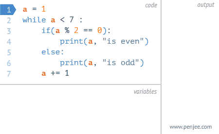

# 实验
## 二
### 三
#### 四
##### 无
###### 六

## 说明
**加粗字体**为学习总结，其他为测试用的无意义数据，如有雷同，雨我无瓜

## 列表
### 有序列表
1. 打扫
2. 发顺丰嘎嘎
3. 大师多让他
4. **各种标签与内容之间要有空格**
    1. fkhadsgfidas
        2. fkjahdsfkjsdaf
            4. 房卡山东黄金官方括号
            5. 发顺丰广阔的举案说法
            6. **三层以上的列表前缀与第三层相同**
            7. **有序列表的深层嵌套总是从1开始，与代码中的序号无关**
            8. **有序列表的第一层前缀为数字，第二层为罗马数字，第三层为字母**
    4. **以上总结均为在火狐浏览器中的运行结果，与码云平台中的显示有所出入**
7. 大厦大厦东方
8. **有序列表的同层序号总是递增加一的**
### 无序列表
+ 发大水
    * 接孩儿
    * 阿尔菲推荐哦爱人
    * 欧力居然敢
        - 案发后年
            + 就爱上对方hi阿䦹
        - ajkdfhkasfh
            * sdafdasdf
+ 阿斯蒂芬
    - 打
    - 发他f
+ 大发
    + 奥斯卡发货
        + 暗示法卡戴珊、
            + 方大三房
    * **列表的嵌套层次由代码中的缩进符决定，与代码中使用的前缀符号无关**
        - **有以上信息推测，不同浏览器中对markdown语法的解释是不同的**
        - **教训：测试环境与真实环境并不一定是一致的**
        - **教训2：不要在临下班时查看代码效果，否则你可能回不了家了**


## 引用

> 大于号<br/>
> 多行<br/>
> 只在收尾行<br/>
> 首添加大于号  
> **markdown会自动忽略代码中的换行符，若必须换行，需要使用<br/\>标签或者在行末键入两个空格后换行**  
**若想要显示markdown语法中的一些符号，需要在符号前添加反斜杠\\（回车键上方）**  

**若在引用结束后接着普通文本，引用结束时的空行是必要的，若不添加空行，则普通文本会被解释称为另一行引用，如上一行**

## 代码
三个点，键盘左上角
```
cout << endl;
```

## 分割线
三个及三个以上的星号
***
***

## 引用图片


#### 动图插入


## 表格
表头1|表头2|表头3
-----|-:|:-:
**markdown语法中的表格必须带有表头**|挂水电费|发沙发垫
家伙是的放开建安费|发送阶段划分宫复|法鸡水电费拉据

## 插入链接
外部链接
> 语法：\[显示的文本\]\(目标网址的URL\)，例如：  
> [百度](https://www.baidu.com)

网页内部链接
> 在github和码云中，markdown文件被解释为html页面后，每个带#的标题都会有一个与内容一样的锚点，所以可以利用锚点进行页面内的定位  
> 语法：\[要显示的链接文字\]\(#要跳转的标题名\)，例如：[引用图片](#引用图片)  

其他
> 插入链接的原生语法为：\[显示的文本\]\(URL\)  
> 当URL为完整的网址时，转换为页面后的链接指向的就是该网址  
> 当URL不是完整的网址时，转换为页面后的链接指向的地址为当前页面的url+括号里面的URL，所以可以访问本页面的锚点